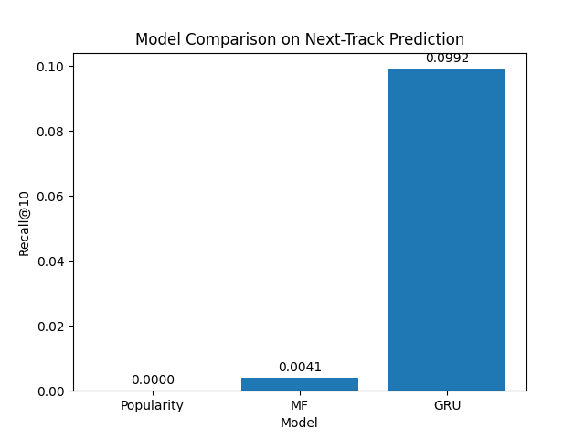

# Music Recommendation System with Last.fm 1K

## Overview
This project builds an end-to-end recommendation pipeline on the Last.fm 1K listening dataset. The goal is to predict the next track a user will listen to using both static and sequential recommendation models.

## System Architecture

- **Data Processing:** Raw TSV → Parquet → Cleaned interactions  
- **Modeling:** Popularity baseline, Matrix Factorization, GRU  
- **Evaluation:** Recall@10 on time-based split  
- **Storage:** SQLite database for recommendations  
- **Serving Layer:** SQL queries / mini app (future)

## Pipeline
1. Load raw Last.fm listening logs
2. Clean and filter interactions
3. Create time-based train/validation/test splits
4. Evaluate a popularity baseline
5. Train a matrix factorization model in PyTorch
6. Train a GRU-based sequential recommender
7. Compare models using Recall@10
8. Export recommendations to SQLite database and join with metadata (track + artist).

## Dataset
This project uses the Last.fm 1K user listening dataset.

Because the raw dataset is large, it is not included in this repository. Place the raw TSV file in:

`data/raw/userid-timestamp-artid-artname-traid-traname.tsv`

## Results

| Model | Users Evaluated | Recall@10 |
|------|---------------:|----------:|
| Popularity | 983 | 0.0000 |
| Matrix Factorization | 983 | 0.0041 |
| GRU (top-20k tracks) | 393 | 0.0992 |

## Result Visualization



## Key Takeaways
- Global popularity performs poorly for next-track prediction.
- Matrix factorization improves over popularity by learning personalized user-item embeddings.
- GRU performs much better on the in-vocabulary subset because recent sequence information is highly predictive.

## Database Integration

Recommendations and metadata are exported to a SQLite database for efficient querying and serving.

### Tables
- `recommendations(user_id, track_id, rank, score, model_name)`
- `tracks(track_id, track_name, artist_name)`

### Example Query
```sql
SELECT t.track_name, t.artist_name, r.score
FROM recommendations r
JOIN tracks t ON r.track_id = t.track_id
WHERE r.user_id = 'user_000001'
ORDER BY r.rank;
```

## Notes
- The GRU model was restricted to the top 20,000 most frequent tracks to make training feasible on CPU.
- As a result, GRU evaluation covers only users whose test targets are inside that item vocabulary.
- No side features (genre, tags, etc.).
- Evaluation uses only Recall@10 (no ranking metrics like NDCG).

## Reproducibility

- Random seeds are not fixed, so results may vary slightly
- Training is CPU-based and may take time on large subsets

## Future Work
- Scale sequential modeling to the full item catalog
- Combine candidate generation and ranking
- Add metadata and temporal features
- Try transformer-based sequential recommenders
- Optimize training with GPU and better sampling

## How to Run

### 1. Install dependencies
```bash
pip install -r requirements.txt
```

### 2. Build raw parquet
```bash
python src/build_raw_parquet.py
```

### 3. Clean data
```bash
python src/clean_data.py
```

### 4. Split data
```bash
python src/split_data.py
```

### 5. Run popularity baseline
```bash
python src/baseline_popularity.py
```

### 6. Prepare indices and train MF
```bash
python src/prepare_indices.py
python src/train_mf.py
```

### 7. Prepare sequences and train GRU
```bash
python src/prepare_sequences.py
python src/train_gru.py
```

### 8. Export recommendations to SQLite
```bash
python src/export_tracks_to_sql.py
python src/export_mf_recs_to_sql.py
```

### 9. Query recommendations
```bash
python src/query_sql.py
```
